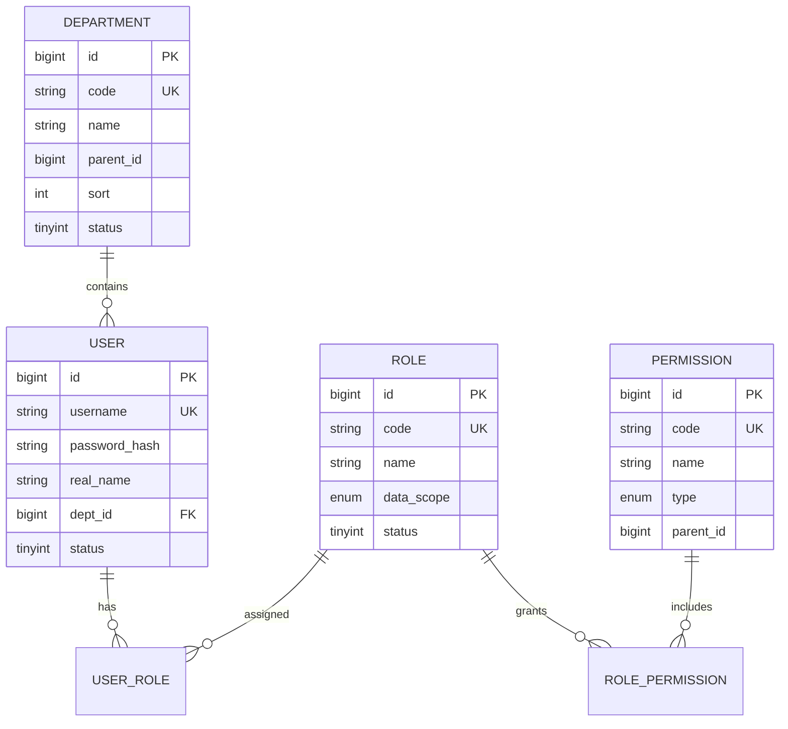
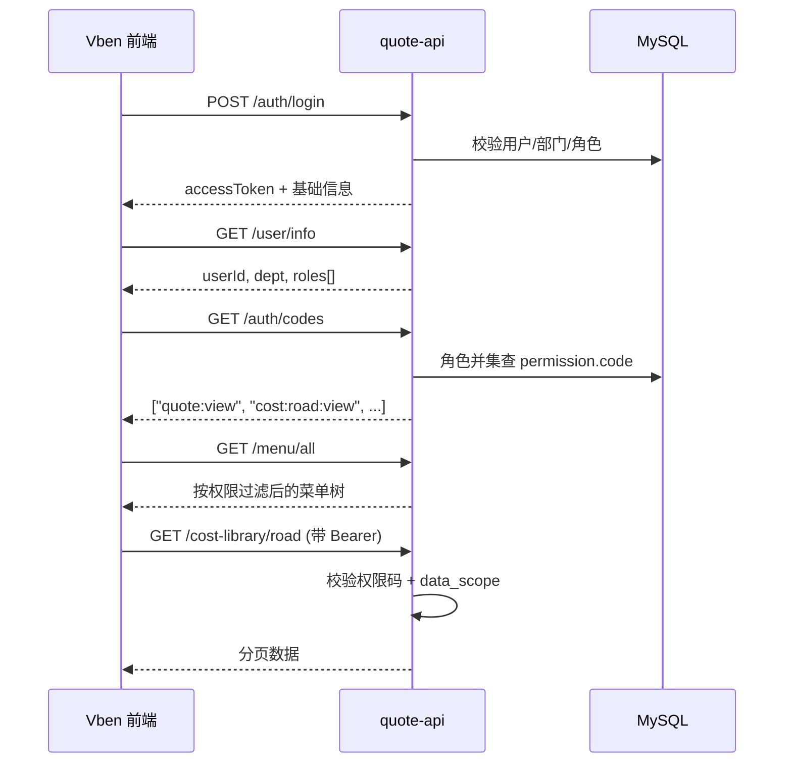

# 福瑞多报价系统：部门 · 角色 · 用户 · 权限 设计

> 版本：v0.1 · 适用于 Java 后端 + Vben Admin 前端

## 1. 设计目标

- **部门**表示组织归属（谁属于哪个业务单元），用于**数据可见范围**。
- **角色**表示职能（能做什么），用于**菜单、按钮、接口**授权。
- **用户**绑定一个主部门，可拥有多个角色。
- **权限**是最小授权单元（权限码），通过角色分配，不直接绑用户（超级管理员除外）。

原则：**部门管「能看到哪些数据」，角色管「能执行哪些操作」。**

---

## 2. 公司部门（固定主数据）

| 编码 | 名称 | 说明 |
|------|------|------|
| `CS` | 客服部 | 接单询价、维护客户、创建/跟进报价单 |
| `DOC` | 单证部 | 单证制作与核对、报价单只读及导出 |
| `OPS` | 海外操作部 | 海外段操作、执行状态更新 |
| `BKG` | 订舱部 | 订舱、海运/铁路成本维护 |
| `FIN` | 财务部 | 金额审核视角、报表导出，不改业务操作 |

部门为**树形预留**（`parent_id`），当前全部挂在一级，后续可拆分子组。

---

## 3. 核心实体关系



---

## 4. 数据权限（Data Scope）

每个角色带一个 `data_scope`，用户拥有多角色时取**最宽**范围：

| 优先级 | data_scope | 含义 |
|--------|------------|------|
| 1（最宽） | `ALL` | 全公司数据 |
| 2 | `DEPT` | 仅本部门及（可选）下级部门 |
| 3（最窄） | `SELF` | 仅本人创建的数据 |

判定规则：

```
effective_scope = max(role.data_scope for role in user.roles)
```

查询报价单/成本时统一追加数据过滤：

| effective_scope | SQL 逻辑（示例） |
|-----------------|------------------|
| `ALL` | 无额外条件 |
| `DEPT` | `dept_id = :userDeptId` 或 `creator_dept_id = :userDeptId` |
| `SELF` | `created_by = :userId` |

---

## 5. 角色设计

### 5.1 系统级角色

| 编码 | 名称 | data_scope | 说明 |
|------|------|------------|------|
| `super_admin` | 超级管理员 | ALL | 系统配置、用户/角色/部门管理，不受业务限制 |
| `admin` | 系统管理员 | ALL | 日常运维，可不赋财务敏感权限 |

### 5.2 业务角色（与部门推荐搭配）

| 编码 | 名称 | data_scope | 典型部门 |
|------|------|------------|----------|
| `dept_manager` | 部门主管 | DEPT | 各部门负责人 |
| `sales` | 销售/客服 | SELF 或 DEPT | 客服部 |
| `doc_clerk` | 单证员 | DEPT | 单证部 |
| `overseas_operator` | 海外操作 | DEPT | 海外操作部 |
| `booker` | 订舱员 | DEPT | 订舱部 |
| `finance` | 财务 | ALL 或 DEPT | 财务部 |
| `viewer` | 只读 | DEPT | 各部门实习生/协作账号 |

> 用户：`客服部` + `sales`；`订舱部` + `booker` + `dept_manager`（主管）。

### 5.3 部门默认角色模板（入职快捷配置）

| 部门 | 默认角色 |
|------|----------|
| 客服部 | `sales` |
| 单证部 | `doc_clerk` |
| 海外操作部 | `overseas_operator` |
| 订舱部 | `booker` |
| 财务部 | `finance` |

创建用户时根据 `dept_id` 预填角色，管理员可再调整。

---

## 6. 权限码设计

命名规范：`{模块}:{资源}:{操作}`，全小写，冒号分隔。

### 6.1 系统管理

| 权限码 | 说明 |
|--------|------|
| `sys:dept:view` | 查看部门 |
| `sys:dept:manage` | 增删改部门 |
| `sys:user:view` | 查看用户 |
| `sys:user:manage` | 增删改用户、重置密码 |
| `sys:role:view` | 查看角色 |
| `sys:role:manage` | 角色与权限分配 |

### 6.2 概览

| 权限码 | 说明 |
|--------|------|
| `dashboard:view` | 报价分析页 |

### 6.3 成本库

| 权限码 | 说明 |
|--------|------|
| `cost:road:view` | 卡车成本库-查看 |
| `cost:road:edit` | 卡车成本库-新建/编辑/导入 |
| `cost:sea:view` | 海运成本-查看 |
| `cost:sea:edit` | 海运成本-编辑 |
| `cost:rail:view` | 铁路成本-查看 |
| `cost:rail:edit` | 铁路成本-编辑 |

### 6.3.1 成本库表格模板

| 权限码 | 说明 |
|--------|------|
| `cost:road:template:view` | 卡车模板-查看列表/详情 |
| `cost:road:template:edit` | 卡车模板-新建/编辑/启用 |
| `cost:road:template:delete` | 卡车模板-删除 |
| `cost:sea:template:view` | 海运模板-查看 |
| `cost:sea:template:edit` | 海运模板-编辑/启用 |
| `cost:sea:template:delete` | 海运模板-删除 |
| `cost:rail:template:view` | 铁路模板-查看 |
| `cost:rail:template:edit` | 铁路模板-编辑/启用 |
| `cost:rail:template:delete` | 铁路模板-删除 |

### 6.4 报价单（预留）

| 权限码 | 说明 |
|--------|------|
| `quote:view` | 查看报价单 |
| `quote:create` | 新建报价 |
| `quote:edit` | 编辑草稿 |
| `quote:submit` | 提交审核 |
| `quote:approve` | 审批 |
| `quote:export` | 导出 PDF/Excel |
| `quote:delete` | 删除草稿 |

### 6.5 报表

| 权限码 | 说明 |
|--------|------|
| `report:view` | 查看报表 |
| `report:export` | 导出报表 |

---

## 7. 角色 ↔ 权限 矩阵（首期）

| 权限 | super_admin | admin | dept_manager | sales | doc_clerk | overseas_operator | booker | finance | viewer |
|------|:-----------:|:-----:|:------------:|:-----:|:---------:|:-----------------:|:------:|:-------:|:------:|
| sys:* | ✓ | 部分 | | | | | | | |
| dashboard:view | ✓ | ✓ | ✓ | ✓ | ✓ | ✓ | ✓ | ✓ | ✓ |
| cost:*:view | ✓ | ✓ | ✓ | ✓ | ✓ | ✓ | ✓ | ✓ | ✓ |
| cost:road:edit | ✓ | ✓ | | | | | | | |
| cost:sea:edit | ✓ | ✓ | | | | | ✓ | | |
| cost:rail:edit | ✓ | ✓ | | | | | ✓ | | |
| cost:*:template:view | ✓ | ✓ | ✓ | ✓ | ✓ | ✓ | ✓ | ✓ | ✓ |
| cost:road:template:edit/delete | ✓ | ✓ | | | | | | | |
| cost:sea/rail:template:edit/delete | ✓ | ✓ | | | | | ✓ | | |
| quote:view | ✓ | ✓ | ✓ | ✓ | ✓ | ✓ | ✓ | ✓ | ✓ |
| quote:create/edit | ✓ | ✓ | ✓ | ✓ | | | | | |
| quote:submit | ✓ | ✓ | ✓ | ✓ | | | | | |
| quote:approve | ✓ | ✓ | ✓ | | | | | ✓ | |
| quote:export | ✓ | ✓ | ✓ | ✓ | ✓ | ✓ | ✓ | ✓ | |
| quote:delete | ✓ | ✓ | | | | | | | |
| report:* | ✓ | ✓ | ✓ | | | | | ✓ | |

**部门差异补充（在角色之上）：**

- **客服部 `sales`**：`quote:create/edit/submit`，成本库只读。
- **订舱部 `booker`**：`cost:sea:edit`、`cost:rail:edit`，报价单只读。
- **财务部 `finance`**：`quote:approve`（金额相关）、`report:export`，不可改成本与操作状态。
- **单证部 `doc_clerk`**：`quote:export`，可更新单证相关字段（后续字段级权限）。
- **海外操作部 `overseas_operator`**：报价单操作状态更新（单独权限 `quote:ops:update` 可二期再加）。

---

## 8. 鉴权流程



### 8.1 接口层校验（后端必须做）

1. **认证**：`Authorization: Bearer {token}` 有效。
2. **授权**：接口标注所需权限码，如 `@RequirePerm("cost:road:view")`。
3. **数据范围**：Service 层根据 `effective_scope` 拼接查询条件。

前端按钮隐藏只是体验，**不能代替后端校验**。

### 8.2 与 Vben 的对接

| 项 | 配置 |
|----|------|
| 权限模式 | `accessMode: 'backend'`（菜单由 `/menu/all` 下发） |
| 权限码 | `GET /auth/codes` 返回字符串数组 |
| 路由 meta | `authority: ['quote:view']` 或 `meta.roles`（二选一，建议 authority） |
| 按钮 | `v-access:code="['cost:road:edit']"` |

---

## 9. 数据库表（首期）

```sql
-- 部门
CREATE TABLE sys_department (
  id          BIGINT PRIMARY KEY AUTO_INCREMENT,
  code        VARCHAR(32)  NOT NULL UNIQUE,
  name        VARCHAR(64)  NOT NULL,
  parent_id   BIGINT       DEFAULT 0,
  sort        INT          DEFAULT 0,
  status      TINYINT      DEFAULT 1 COMMENT '1启用 0停用',
  created_at  DATETIME     DEFAULT CURRENT_TIMESTAMP,
  updated_at  DATETIME     DEFAULT CURRENT_TIMESTAMP ON UPDATE CURRENT_TIMESTAMP
);

-- 用户
CREATE TABLE sys_user (
  id            BIGINT PRIMARY KEY AUTO_INCREMENT,
  username      VARCHAR(64)  NOT NULL UNIQUE,
  password_hash VARCHAR(128) NOT NULL,
  real_name     VARCHAR(64)  NOT NULL,
  dept_id       BIGINT       NOT NULL,
  status        TINYINT      DEFAULT 1 COMMENT '1启用 0禁用',
  created_at    DATETIME     DEFAULT CURRENT_TIMESTAMP,
  updated_at    DATETIME     DEFAULT CURRENT_TIMESTAMP ON UPDATE CURRENT_TIMESTAMP,
  FOREIGN KEY (dept_id) REFERENCES sys_department(id)
);

-- 角色
CREATE TABLE sys_role (
  id          BIGINT PRIMARY KEY AUTO_INCREMENT,
  code        VARCHAR(64)  NOT NULL UNIQUE,
  name        VARCHAR(64)  NOT NULL,
  data_scope  VARCHAR(16)  NOT NULL COMMENT 'ALL|DEPT|SELF',
  status      TINYINT      DEFAULT 1,
  remark      VARCHAR(255)
);

-- 权限
CREATE TABLE sys_permission (
  id          BIGINT PRIMARY KEY AUTO_INCREMENT,
  code        VARCHAR(128) NOT NULL UNIQUE,
  name        VARCHAR(128) NOT NULL,
  type        VARCHAR(16)  NOT NULL COMMENT 'menu|button|api',
  parent_id   BIGINT       DEFAULT 0,
  sort        INT          DEFAULT 0
);

-- 用户-角色
CREATE TABLE sys_user_role (
  user_id BIGINT NOT NULL,
  role_id BIGINT NOT NULL,
  PRIMARY KEY (user_id, role_id)
);

-- 角色-权限
CREATE TABLE sys_role_permission (
  role_id       BIGINT NOT NULL,
  permission_id BIGINT NOT NULL,
  PRIMARY KEY (role_id, permission_id)
);
```

### 9.1 初始化部门数据

```sql
INSERT INTO sys_department (code, name, sort) VALUES
('CS',  '客服部', 1),
('DOC', '单证部', 2),
('OPS', '海外操作部', 3),
('BKG', '订舱部', 4),
('FIN', '财务部', 5);
```

---

## 10. 用户状态与登录

| status | 含义 |
|--------|------|
| 1 | 正常，可登录 |
| 0 | 禁用，拒绝登录 |

登录响应扩展字段：

```json
{
  "userId": "1",
  "username": "zhangsan",
  "realName": "张三",
  "dept": { "id": 1, "code": "CS", "name": "客服部" },
  "roles": ["sales"],
  "accessToken": "..."
}
```

`GET /user/info` 与登录后结构保持一致。

---

## 11. 管理后台菜单规划（二期）

| 菜单 | 权限 |
|------|------|
| 系统管理 → 部门管理 | `sys:dept:view` |
| 系统管理 → 用户管理 | `sys:user:view` |
| 系统管理 → 角色权限 | `sys:role:view` |

仅 `super_admin` / `admin` 可见。

---

## 12. 实施顺序建议

1. **Phase 1**：落库 + 种子数据（5 部门、系统角色、权限码）+ 改造登录返回 dept/roles/codes。
2. **Phase 2**：成本库接口加 `@RequirePerm` + 数据范围过滤。
3. **Phase 3**：前端改 `backend` 菜单模式，路由/按钮绑权限码。
4. **Phase 4**：报价单模块按同一套模型扩展。
5. **Phase 5**：系统管理 CRUD 页面。

---

## 13. 已确认的业务约束

- 一个用户**只有一个主部门**（组织架构清晰）。
- 一个用户**可有多个角色**（兼岗，如主管兼销售）。
- 权限只通过角色授予，避免直接给用户绑权限（除 super_admin）。
- 财务部可看金额，但**默认不可改成本库与操作状态**。
- 客服部是报价主入口，**默认可建单不可改成本**。

---

## 14. 待产品确认（可选）

- [ ] 部门主管能否审批其他部门的单？（当前：仅本部门 `DEPT` 范围）
- [ ] 是否需要「销售只看自己的客户」？（可将 sales 的 data_scope 固定为 `SELF`）
- [ ] 跨部门协作单是否引入「参与人」表？（二期）

确认后可进入 Phase 1 建表与接口开发。
